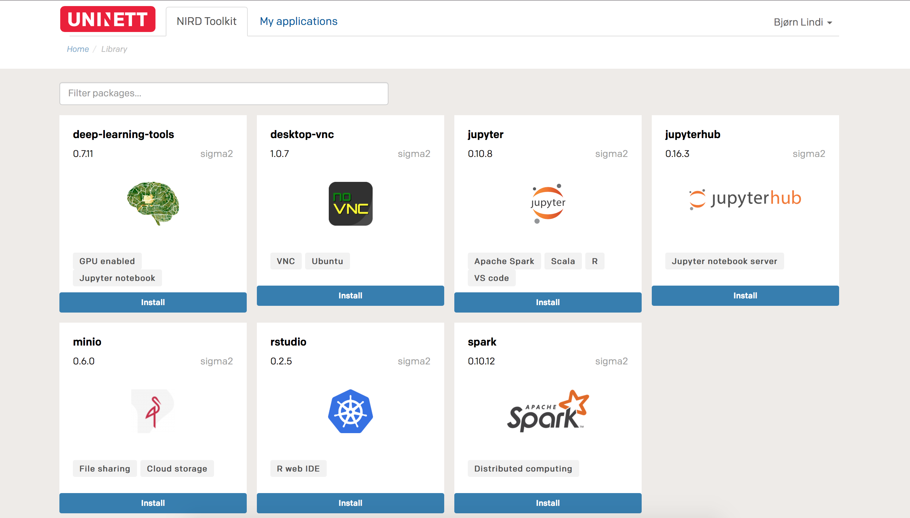

class: center

# Jupyter Notebooks
## Author: Bjørn Lindi

* *English/Norsk?*

--- 

## From NTNU IT

My group provide High Performance Computing services:
* HPC-systems (idun,Saga, Fram, Betzy). Linux platforms with command line interface and batch systems
* Jupyter Notebooks, primarly for teaching  (Open Stack platform)
* National Storage Infrastructure (NIRD)

---

## Nird Tool kit , https://apps.sigma2.no



--- 

## Installing Jupyterlab with miniconda3

First we create a separate python environment. We switch to the
environment and start installing packages.
```sh
$ conda create -n jlab-lesson
$ conda activate jlab-lesson
(jlab-lesson)$ conda install -c conda-forge jupyterlab
(jlab-lesson)$ conda install nodejs
(jlab-lesson)$ nbdime extensions --enable
(jlab-lesson)$ jupyter labextension install @jupyterlab/git
(jlab-lesson)$ pip install jupyterlab-git
(jlab-lesson)$ jupyter serverextension enable --py jupyterlab_git --sys-prefix
```

---

## Starting Jupyterlab
We start the Jupyter Lab instance with command `jupyter-lab`:
```
(jlab-session)$ 
```
